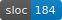

# About

Bowtie is a small programming language for educational use.

It's a subset of Haskell (in fact a subset of Elm!) with algebraic types, pattern matching, recursive 'let', parametric polymorphism, and not much else.

Bowtie is designed to support a WIP [book](http://lambdakit.com/) and [kit](https://github.com/seagreen/bowtie-kit), but those are at a higher level of concern than the language, so this is the only reference to them in this repo.

# In this repo

## [./bowtie](./bowtie)


Reference implementation. Parser, typechecker, and tree-walking evaluator (WIP).

## [./spec](./spec)

Informal specification with a description of the language and test examples (WIP).

## [./example-lib](./example-lib)

Bowtie code!

## [./example-app](./example-app)

Bowtie programs!

```sh
stack install
-- installs bowtie to ./bin/bowtie

./bin/bowtie ./example-app/lunar-lander.bowtie
-- this evaluates lunar-lander and prints the result to the screen.
-- to get this into a webpage and actually play it see ./bowtie-js
```

## [./bowtie-js](./bowtie-js)


JavaScript transpiler (WIP).

```sh
stack install
-- installs bowtie-js to ./bin/bowtie-js

./bin/bowtie-js example-app/lunar-lander.bowtie > bowtie-js/main.js

firefox ./bowtie-js/index.html
```

## [./bowtie-blueprint](./bowtie-blueprint)


Linter for a types-only variant of the language (WIP).

## [./bowtie-visualize](./bowtie-visualize)



Tool to illustrate type inference or term evaluation (WIP).
